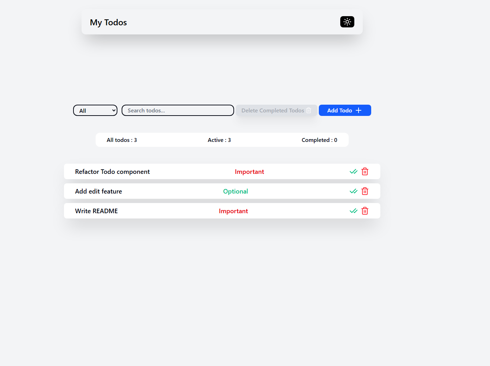
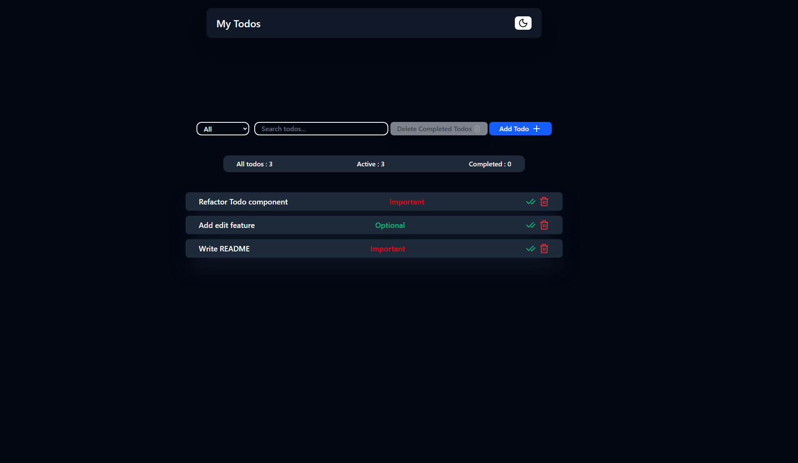

# Todo App

A simple Todo app built with React, Vite, and Tailwind CSS.

## 🌐 Live Demo

👉 https://abolfazlojaghi.github.io/simple-todo/

## 📸 Preview

### Main View




## ✨ Features

- Add and delete todos
- Mark todos as completed
- Search todos by title
- Filter todos (All / Active / Completed)
- Set todo priority
- Dark mode support
- LocalStorage persistence
- Responsive UI

## 🛠️ Tech Stack

- React
- Vite
- Tailwind CSS
- PNPM

## 📦 Installation

Clone the repository:

```bash
git clone https://github.com/abolfazlOjaghi/simple-todo.git
```

Navigate to the project folder:

```bash
cd simple-todo
```

Install dependencies:

```bash
pnpm install
```

Start the development server:

```bash
pnpm dev
```

## 🏗️ Build

Create a production build:

```bash
pnpm build
```

Preview the production build:

```bash
pnpm preview
```

## 📁 Project Structure

```text
simple-todo/
├── public/
├── src/
│   ├── components/
│   ├── features/
│   ├── App.jsx
│   └── main.jsx
├── package.json
├── vite.config.js
└── README.md
```

## 🚀 Future Improvements

- Edit existing todos
- Due dates
- Categories and tags
